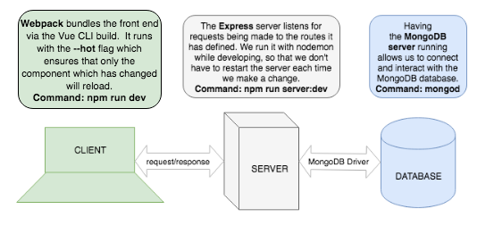

# Homework: Full Stack Games Hub App

### Learning Objectives

- Understand the relationship between client, server and database
- Be able to navigate a codebase that you haven't written

## Brief

Your boss has asked to you look over the codebase of a full-stack JavaScript application. The front-end is written in JavaScript using React, the back-end uses an Express server and a MongoDB database. Your task is to make yourself familiar with the codebase.

The application includes a README.md with instructions on running the application.

*Overview of the tech stack and tooling with commands*

*EDIT: Frontend is now written in React with the command to run `npm start`*

## MVP

### Task

Draw a diagram showing the dataflow through the application starting with a form submission, ending with the re-rendering of the page. This will involve a multi-direction data-flow with the client posting data to the server and the server sending data back to the client with the response. Detail the client, server and database in the diagram and include the names of the files involved in the process.

### Questions

1. What is responsible for defining the routes of the `games` resource?

    create_router.js

2. What do you notice about the folder structure?  Whats the client responsible for? Whats the server responsible for?

    complete separation of concerns. Server is responsible for listening for requests from Client, querying the database, updating if necessary, and returning information to the Client. Client is responsible for displaying the data and allowing the user a means of interacting with that data

3. What are the the responsibilities of server.js?

    listen for requests from client and routing requests to and from the API (database)

4. What are the responsibilities of the `gamesRouter`?

    to define the routes accessible to the server (ie all of the CRUD operations of the system) for a given API (in this case, a collection of games)

5. What process does the the client (front-end) use to communicate with the server?

    it uses GamesService.js to define a series of 'fetch' operations built around the baseURL of the API

6. What optional second argument does the `fetch` method take? And what is it used for in this application? Hint: See [Using Fetch](https://developer.mozilla.org/en-US/docs/Web/API/Fetch_API/Using_Fetch) on the MDN docs

    init - in this application it defines the request method ('POST' here), stores the data to be POSTed in the 'body' option (in JSON format), and sets a header indicating the content type (JSON)

7. Which of the games API routes does the front-end application consume (i.e. make requests to)?

    router.get, router.post and router.delete (using base url: http://localhost:5000/api/games/)

8. What are we using the [MongoDB Driver](http://mongodb.github.io/node-mongodb-native/) for?

    to allow javascript code to talk to the mongodb database which stores our api

## Extension

Why do we need to use [`ObjectId`](https://mongodb.github.io/node-mongodb-native/api-bson-generated/objectid.html) from the MongoDB driver?

Add to your diagram the dataflow for removing a game.
